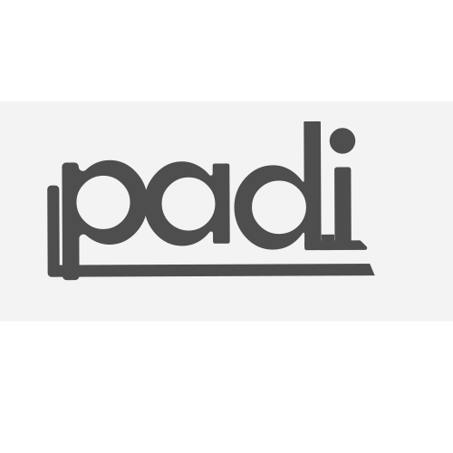

# TUNNUSGRAAFIKA

Siia viskan tunnusgraafika tunnis tehtud tööd.
## 16.03.2021
Paiskan siia oma kolm valikut Padja logodest.

## 24.03.2021
Tuleb lõpetada logo erinevad versioonid.
Tuleb alustada värvipalettide ja kirjatüüpide määramisega.
Tuleb teha koos visiitkaardi või kirjaplanketi vms kujundamisega.